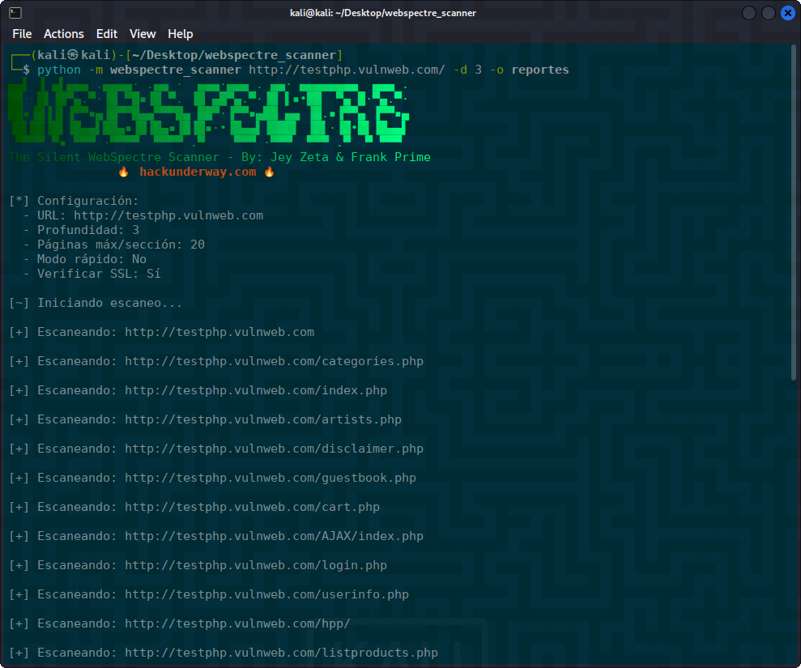

<h1 align="center">WebSpectre 🔎</h1>

<p align="center">
  Escáner web avanzado que permite detectar enlaces válidos de sitios y generar reportes en múltiples formatos.
</p>

<p align="center">
  
  
  
</p>

---

## 🧠 Descripción

**WebSpectre** es una herramienta de escaneo web desarrollada en Python. Realiza análisis profundos o rápidos de sitios web, identificando enlaces válidos y generando reportes automáticos en JSON y PDF. Ideal para análisis de seguridad básicos o auditorías web.

---

## ⚙️ Instalación

Clona el repositorio:

```bash
git clone https://github.com/HackUnderway/webspectre.git
```
```bash
cd webspectre
```
```bash
pip install -r requirements.txt
```
```bash
python -m webspectre_scanner -h
```
```bash
usage: python -m webspectre_scanner [url] [-h] [-d DEPTH] [-o OUTPUT] [--fast-scan] [--max-pages MAX_PAGES] [--no-verify]

WebSpectre Scanner - Escáner web avanzado con verificación de URLs

positional arguments:
  url                   URL objetivo a escanear (ej. https://example.com)

options:
  -h, --help            show this help message and exit
  -d, --depth DEPTH     Profundidad máxima de escaneo (predeterminado: 2)
  -o, --output OUTPUT   Directorio para guardar reportes (se creará si no existe)
  --fast-scan           Modo rápido (limita páginas por sección y excluye APIs)
  --max-pages MAX_PAGES
                        Límite de páginas por sección (predeterminado: 20)
  --no-verify           Deshabilitar verificación SSL

Ejemplos de uso:
  Escaneo básico: python -m webspectre_scanner https://example.com
  Escaneo profundo: python -m webspectre_scanner https://example.com -d 3 -o reportes
  Escaneo rápido: python -m webspectre_scanner https://example.com --fast-scan
```
## 🚀 Uso
##### Escaneo básico
python -m webspectre_scanner https://example.com

##### Escaneo profundo con reportes
python -m webspectre_scanner https://example.com -d 3 -o reportes

##### Escaneo rápido
python -m webspectre_scanner https://example.com --fast-scan

<p align="center">
  
</p>

> **El proyecto está abierto a colaboradores.**

# DISTRIBUCIONES SOPORTADAS
|Distribución | Versión verificada | 	쯉oportado? | 	Estado |
|--------------|--------------------|------|-------|
|Kali Linux| 2025.1| si| funcionando   |
|Parrot Security OS| 6.2| si | funcionando   |
|Windows| 11 | si | funcionando   |
|BackBox| 9 | si | funcionando   |
|Arch Linux| 2024.12.01 | si | funcionando   |

# SOPORTE
Preguntas, errores o sugerencias: info@hackunderway.com

# LICENSE
- [x] WebSpectre tiene licencia.
- [x] Consulta el archivo [LICENSE](https://github.com/HackUnderway/webspectre#MIT-1-ov-file) para más información.

# CYBERSECURITY RESEARCHER

* [Victor Bancayan](https://www.offsec.com/bug-bounty-program/) - (**CEO at [Hack Underway](https://www.instagram.com/hackunderway/)**) 

## 🔗 ENLACES
[](https://www.patreon.com/c/HackUnderway)
```
Fanpage: https://www.facebook.com/HackUnderway
X: https://x.com/JeyZetaOficial
Web site: https://hackunderway.com
Youtube: https://www.youtube.com/@JeyZetaOficial
```
## 🌞 Suscripciones
Afíliate:

- [Jey Zeta](https://www.facebook.com/JeyZetaOficial/subscribe/)

[](https://www.kali.org/)

from  made in  with  by: <font color="red">Victor Bancayan</font>, if you want Donate <a href="https://www.buymeacoffee.com/HackUnderway"></a>

© 2025

